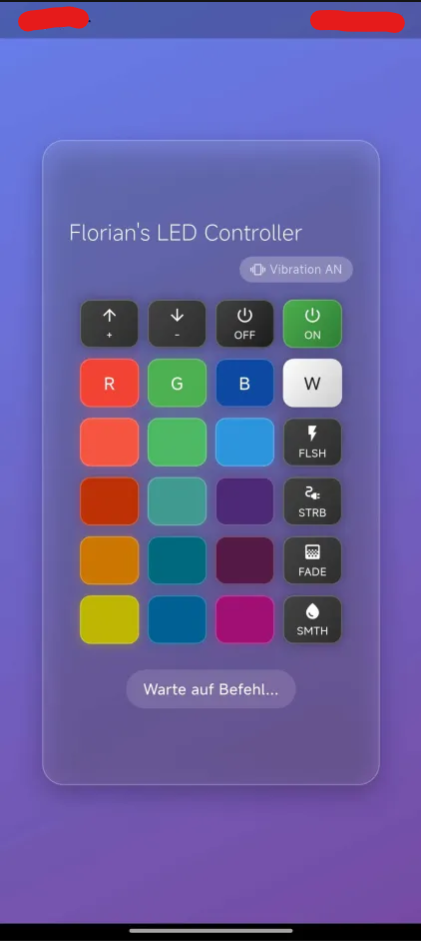

# 🚀 LED Control

This Flutter application allows you to control LED devices via infrared signals. It features a sleek and user-friendly interface designed to enhance your experience.
I tested the app on a Xiaomi Redmi Note 12 Pro+ with the built-in IR blaster. Please ensure your device supports infrared communication.

Also this does not work on iOS devices as they do not have IR blasters.
This LED panel is based on the [ISY](https://www.isy-online.eu/) LED system, it may work with other systems as well, but this is not guaranteed.

**Disclaimer:** This project is for educational purposes only. Ensure you comply with all relevant laws and regulations regarding the use of infrared devices in your region. I am **not** responsible for any misuse of this application.

**Note:** The ISY LED system is universal, meaning that the “infrared signals” are not specific and are the same for every device, which means that this app could also control third-party LED systems that use the same signals as the ISY system.

## 📋 Table of Contents

- [📸 Screenshots](#-screenshots)
- [🏆 Acknowledgments](#-acknowledgments)

## 📸 Screenshots

## 🏆 Acknowledgments

### Tools & Libraries Used

---

**[⬆ Back to Top](#-flutter-login-ui---1)**

Made with ❤️ by [Florian](https://github.com/Fedox-die-Ente)

---

generated using [better-repo](https://github.com/Fedox-die-Ente/better-repo)

